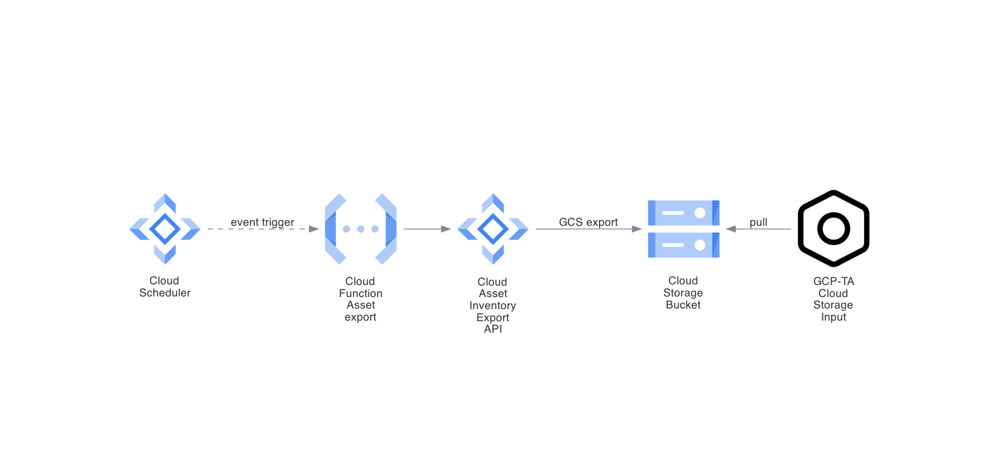
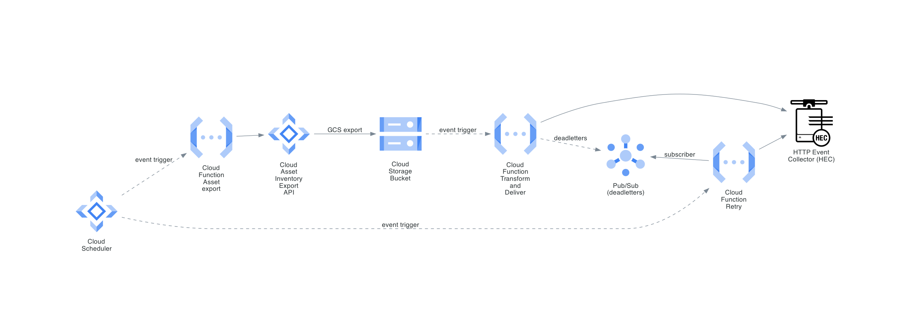
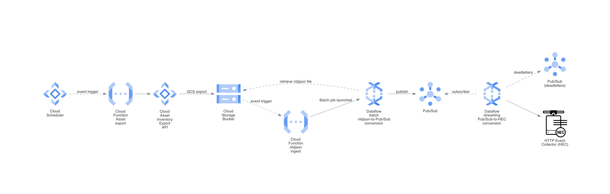

# Taking Inventory of Your Google Cloud

Splunk Cloud Architect [Paul Davies](https://github.com/pauld-splunk) recently authored and released the [GCP Application Template](https://splunkbase.splunk.com/app/5404/), a blueprint of visualizations, reports, and searches focused on Google Cloud use cases. Many of the reports included in his application require Google Cloud [asset inventory](https://cloud.google.com/asset-inventory) data to be periodically generated and sent into Splunk. But *how exactly* do you craft that inventory generation pipeline so you can "light-up" Paul's application dashboards and reports?

In this blog post, I'll describe and compare three methods operators can use to ingest Google Cloud asset inventory data  into Splunk. The first method leverages a "pull" data ingest strategy while the other two methods I cover are "push" based. For each ingest method, I'll provide detailed setup instructions or provide pointers to them. Finally, I'll make a personal recommendation on what method I would choose if it was my own environment.

## Note: Export vs. Feed

Google provides both a [batch export](https://cloud.google.com/asset-inventory/docs/exporting-to-cloud-storage) and a [change feed](https://cloud.google.com/asset-inventory/docs/monitoring-asset-changes) view of asset data. The GCP Application Template leverages data generated by the [batch export data API](https://cloud.google.com/asset-inventory/docs/reference/rest/v1p7beta1/TopLevel/exportAssets) and does not support the [TemporalAsset](https://cloud.google.com/asset-inventory/docs/reference/rpc/google.cloud.asset.v1#temporalasset) schema used in the [asset change feed API](https://cloud.google.com/asset-inventory/docs/reference/rpc/google.cloud.asset.v1#createfeedrequest).

## Pull

### Method #1 - Pull from bucket

The first method involves using Cloud Scheduler to trigger a Cloud Function on a regular schedule. This Cloud Function then sends a batch export request to the Asset Inventory API. This results in a bulk export of the current cloud asset inventory to a Cloud Storage bucket. Finally, the Splunk Add-on for Google Cloud Platform (GCP-TA) is configured to periodically monitor and ingest new files appearing in the Cloud Storage bucket. The following diagram illustrates this process.

#### Components

* Cloud Scheduler
* Cloud Pub/Sub
* [Cloud Function (asset export)](https://github.com/splunk/splunk-gcp-functions/blob/master/Assets/main.py)
* Asset Inventory API
* Cloud Storage
* [GCP-TA storage input](https://docs.splunk.com/Documentation/AddOns/released/GoogleCloud/Configureinputsv4storagebuckets)

#### Pros

* Simple setup
* Pull solution avoids Splunk HEC whitelisting considerations
* GCP-TA is developed and supported by Splunk
* Minimal Google Cloud infrastructure cost to implement

#### Cons

* Large inventories may exceed file size limitations of GCP-TA GCS input (~250 MB)

#### Setup

Please refer to the [detailed setup instructions](https://github.com/mhite/taking-inventory-of-your-google-cloud/blob/main/taking-inventory-of-your-google-cloud.md#setup) in the GitHub repository.

## Push

### Method #2 - Serverless push-to-Splunk

This method leverages Cloud Functions not only for triggering an export of asset inventory data, but also to perform the delivery to a Splunk HEC. Cloud Scheduler regularly triggers a Cloud Function which in turn is responsible for initiating an Asset Inventory API bulk export to Cloud Storage. A second Cloud Function is configured to trigger on bucket object create/finalize events. This function will split the exported files into smaller files if necessary and deliver them directly to a Splunk HEC. Should the delivery fail, the messages are placed into a Pub/Sub topic for later redelivery attempts. The following diagram illustrates this process.

#### Components

* Cloud Scheduler
* [Cloud Function (asset export)](https://github.com/splunk/splunk-gcp-functions/blob/master/Assets/main.py)
* Asset Inventory API
* Cloud Storage
* [Cloud Function (Cloud Storage ingest)](https://github.com/splunk/splunk-gcp-functions/blob/master/GCS/main.py)
* Pub/Sub
* [Cloud Function (delivery retry)](https://github.com/splunk/splunk-gcp-functions/tree/master/Retry)
* [Splunk HEC](https://docs.splunk.com/Documentation/Splunk/8.1.3/Data/UsetheHTTPEventCollector)

#### Pros

* Solution should incur minimal Google Cloud infrastructure costs
* Automated redelivery attempts of deadletters
* GCP Application Template is primarily tested with this method as it is written by the same [author](https://github.com/pauld-splunk)

#### Cons

* [Not a Splunk or Google supported solution](https://github.com/splunk/splunk-gcp-functions/blob/master/README.md#support)

#### Setup

Details on how to configure this method can be found in the [splunk-gcp-functions GitHub repository](https://github.com/splunk/splunk-gcp-functions/tree/master/Assets).

### Method #3 - Dataflow

The final method leverages Dataflow batch and streaming jobs to facilitate delivery of asset inventory data to a Splunk HEC. This approach uses Cloud Scheduler to regularly trigger a Cloud Function which in turn is responsible for initiating an Asset Inventory API bulk export to Cloud Storage. Another Cloud Function receives an event trigger when the export operation is complete. This function then starts a [batch Dataflow job which converts newline-delimited JSON files into Pub/Sub messages](https://cloud.google.com/dataflow/docs/guides/templates/provided-batch#gcstexttocloudpubsub) and publishes them to a topic. In parallel, a [streaming Dataflow pipeline is also running](https://cloud.google.com/dataflow/docs/guides/templates/provided-streaming#cloudpubsubtosplunk) which subscribes to the aforementioned topic and delivers them to a Splunk HEC.

The following diagram illustrates this process.

#### Components

* Cloud Scheduler
* Cloud Function (asset export)
* Asset Inventory API
* Cloud Storage
* Cloud Function (launch Dataflow batch job)
* [Batch Dataflow job](https://cloud.google.com/dataflow/docs/guides/templates/provided-batch#gcstexttocloudpubsub)
* Pub/Sub
* [Streaming Dataflow job](https://cloud.google.com/dataflow/docs/guides/templates/provided-batch#gcstexttocloudpubsub)
* [Splunk HEC](https://docs.splunk.com/Documentation/Splunk/8.1.3/Data/UsetheHTTPEventCollector)

#### Pros

* Dataflow templates developed and supported by Google
* Natural choice for environments already leveraging streaming Dataflow to Splunk HEC log delivery pipeline
* Dead letter topic support for undeliverable messages
* Easy to monitor delivery backlog through Google Cloud Pub/Sub metrics
* Encryption of HEC token using KMS

#### Cons

* Both Dataflow templates are in [beta, pre-GA launch stage](https://cloud.google.com/products#product-launch-stages)
* More complex setup required compared to other methods
* Additional costs of running a Dataflow cluster

#### Setup

Please refer to the [detailed setup instructions](https://github.com/mhite/taking-inventory-of-your-google-cloud/blob/main/taking-inventory-of-your-google-cloud.md#setup-2) in the GitHub repository.

## Recommendation

In this blog, I've described three methods for ingesting cloud asset inventory data into Splunk. But which is "the best?" Like many things in cloud, there isn't one universally "right" answer.

If you're just getting started and just want to get the reports up and running, I recommend trying the "pull from bucket" method described in option #1. The number of moving pieces is minimal and it is relatively easy to setup. It's also dirt cheap in comparison to other approaches and will likely take you pretty far.

If you're already using Dataflow to stream Cloud Logging events into Splunk, then I recommend pursuing option #3. Customers usually find themselves turning to the Dataflow method for sending Cloud Logging events to Splunk as they scale out their infrastructure and need to ensure what they deploy is easy to monitor, horizontally-scalable, and fault-tolerant. Why not leverage that same infrastructure investment to deliver asset inventory data to Splunk?

If option #3 is not within your reach or you view it as "overkill," the "serverless push-to-Splunk" method described in option #2 may be preferable. It has some of the same fault-tolerant and horizontally scalable properties I praise when positioning Dataflow but without the cost of running a batch streaming Dataflow job. Keep in mind that neither Google or Splunk support can assist in the operation of this method, however. You could find yourself "on your own" should things go wrong -- if you're building a production pipeline, skip this method. If you're having fun in the lab, go for it.

## Conclusion

Whether you're just experimenting in a lab environment or building a production Dataflow pipeline, one of the methods described in this blog should have your cloud inventory ingest requirements covered. And once you've got that data into Splunk, you'll be generating dashboards and reports with the GCP Application Template in no time!

## Resources

* [GCP Application Template](https://splunkbase.splunk.com/app/5404/)
* [Splunk Add-on for Google Cloud Platform](https://splunkbase.splunk.com/app/3088/)
* [GCP Functions Library for Ingesting into Splunk](https://github.com/splunk/splunk-gcp-functions)
* [Deploying production-ready log exports to Splunk using Dataflow](https://cloud.google.com/architecture/deploying-production-ready-log-exports-to-splunk-using-dataflow)
* [Pub/Sub to Splunk streaming Dataflow template](https://cloud.google.com/dataflow/docs/guides/templates/provided-streaming#cloudpubsubtosplunk)
* [Cloud Storage to Pub/Sub batch Dataflow template](https://cloud.google.com/dataflow/docs/guides/templates/provided-batch#gcstexttocloudpubsub)
